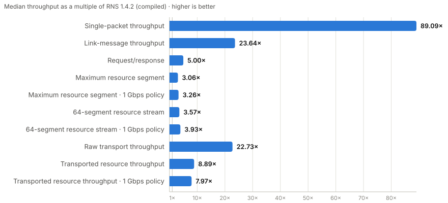
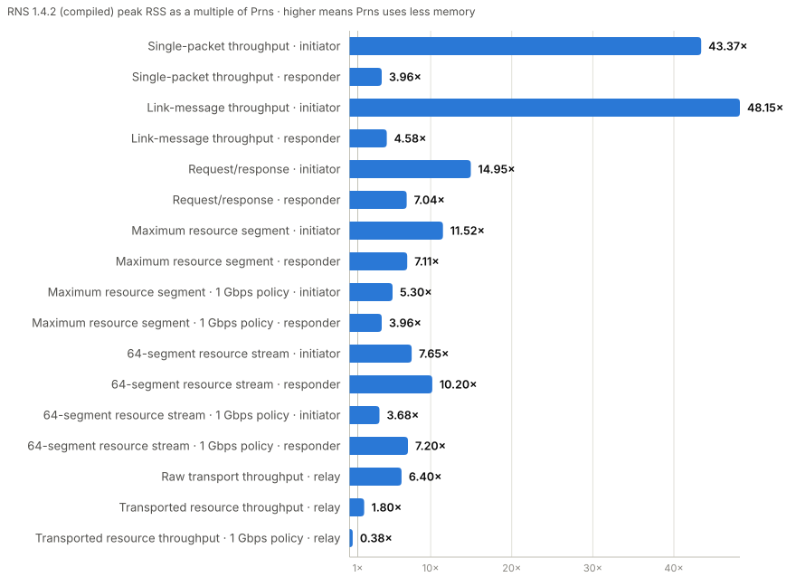

# Benchmark results — `aarch64-apple-darwin`

[← All hosts](RESULTS.md)

> **Qualification: COMPLETE.** 34/34 cells; 102/102 conformant samples; exact source `d18cfb145f9fef114b366f4132da75513feb8022`; source tree clean.

## Machine and method

Apple M4; 10 physical / 10 logical; 16.0 GiB; macOS 26.4.

Release binaries run over loopback for 30 seconds per sample, three samples per cell. Endpoint scenarios cover all four initiator/responder pairings; relay scenarios cover both implementations behind the same fixed bidirectional wire driver. Default-policy rows preserve each implementation's normal TCP bitrate and MTU policy. The controlled 1 Gbps resource rows change only that interface policy, both for real endpoint transfers and for transported-resource switching; the tiny raw SINGLE relay scenario remains default-policy-only. Tables show median throughput and latency; memory is the maximum peak RSS. Energy is optional: it is metered processor energy minus a fresh idle baseline (macOS CPU Power; Linux RAPL package) and appears only when all three samples are positive. Packet/request energy is per delivery; resource energy is normalized per application MiB. Initiator/responder energy is the combined package measurement attributed by each role's CPU-time share. Relay-scenario package energy is explicitly whole-cell energy; only CPU and RSS are relay-isolated. A check means every sample satisfied the scenario's accounting rule.

## At a glance

<picture>
  <source media="(prefers-color-scheme: dark)" srcset="assets/at-a-glance-aarch64-apple-darwin-dark.svg">
  
</picture>

<picture>
  <source media="(prefers-color-scheme: dark)" srcset="assets/at-a-glance-memory-aarch64-apple-darwin-dark.svg">
  
</picture>

Chart data as a table

| Scenario | Prns | Reference | Prns / reference |
|---|---:|---:|---:|
| Single-packet throughput | 37.4k/s | 420/s | 89.09× |
| Link-message throughput | 74.1k/s | 3.1k/s | 23.64× |
| Request/response | 5.0k/s | 997/s | 5.00× |
| Maximum resource segment | 302.71 MB/s | 99.08 MB/s | 3.06× |
| Maximum resource segment · 1 Gbps policy | 301.39 MB/s | 92.41 MB/s | 3.26× |
| 64-segment resource stream | 464.67 MB/s | 130.17 MB/s | 3.57× |
| 64-segment resource stream · 1 Gbps policy | 463.10 MB/s | 117.78 MB/s | 3.93× |
| Raw transport throughput | 249.32 MB/s | 10.97 MB/s | 22.73× |
| Transported resource throughput | 1313.24 MB/s | 147.67 MB/s | 8.89× |
| Transported resource throughput · 1 Gbps policy | 1194.50 MB/s | 149.80 MB/s | 7.97× |

| Scenario · role | Prns peak RSS | Reference peak RSS | Reference / Prns |
|---|---:|---:|---:|
| Single-packet throughput · initiator | 4.5 MiB | 196.5 MiB | 43.37× |
| Single-packet throughput · responder | 49.6 MiB | 196.5 MiB | 3.96× |
| Link-message throughput · initiator | 4.7 MiB | 227.2 MiB | 48.15× |
| Link-message throughput · responder | 48.4 MiB | 221.8 MiB | 4.58× |
| Request/response · initiator | 18.0 MiB | 269.9 MiB | 14.95× |
| Request/response · responder | 47.5 MiB | 334.6 MiB | 7.04× |
| Maximum resource segment · initiator | 43.0 MiB | 495.8 MiB | 11.52× |
| Maximum resource segment · responder | 40.2 MiB | 285.7 MiB | 7.11× |
| Maximum resource segment · 1 Gbps policy · initiator | 75.2 MiB | 398.1 MiB | 5.30× |
| Maximum resource segment · 1 Gbps policy · responder | 76.7 MiB | 303.5 MiB | 3.96× |
| 64-segment resource stream · initiator | 46.1 MiB | 352.6 MiB | 7.65× |
| 64-segment resource stream · responder | 40.3 MiB | 411.3 MiB | 10.20× |
| 64-segment resource stream · 1 Gbps policy · initiator | 78.2 MiB | 287.6 MiB | 3.68× |
| 64-segment resource stream · 1 Gbps policy · responder | 75.9 MiB | 546.8 MiB | 7.20× |
| Raw transport throughput · relay | 49.5 MiB | 316.8 MiB | 6.40× |
| Transported resource throughput · relay | 147.1 MiB | 264.7 MiB | 1.80× |
| Transported resource throughput · 1 Gbps policy · relay | 542.0 MiB | 204.9 MiB | 0.38× |

A dash means no current three-sample release evidence is published for that scenario.

## Detailed results

### Links

#### Link-message throughput (v8)

Sustained delivery of small messages over one established link.

| Subject | Conformance | Rate | Goodput | RTT p50 / p99 | Peak RSS (i / r) | Energy / delivery (i / r) |
|---|---:|---:|---:|---:|---:|---:|
| Prns → Prns |  6669853/6669853 · 3/3 samples | 74.1k/s | 17.78 MB/s | <1.00 / 1.00 ms | i 4.7 MiB / r 48.4 MiB | i 0.15 mJ / r 0.04 mJ |
| Prns → RNS 1.4.2 (compiled) |  785443/785443 · 3/3 samples | 8.7k/s | 2.08 MB/s | 2.00 / 2.00 ms | i 4.6 MiB / r 263.3 MiB | i 0.72 mJ / r 0.62 mJ |
| RNS 1.4.2 (compiled) → Prns |  362583/362583 · 3/3 samples | 4.0k/s | 959.2 kB/s | <1.00 / 1.00 ms | i 232.1 MiB / r 11.6 MiB | i 1.04 mJ / r 0.15 mJ |
| RNS 1.4.2 (compiled) → RNS 1.4.2 (compiled) |  286626/286626 · 3/3 samples | 3.1k/s | 752.1 kB/s | <1.00 / 3.00 ms | i 227.2 MiB / r 221.8 MiB | i 1.15 mJ / r 0.80 mJ |

### Packets

#### Single-packet throughput (v6)

Sustained proved delivery of varied-size one-shot packets over TCP.

| Subject | Conformance | Rate | Goodput | RTT p50 / p99 | Peak RSS (i / r) | Energy / delivery (i / r) |
|---|---:|---:|---:|---:|---:|---:|
| Prns → Prns |  3360887/3360887 · 3/3 samples | 37.4k/s | 8.23 MB/s | <1.00 / 1.00 ms | i 4.5 MiB / r 49.6 MiB | i 0.27 mJ / r 0.20 mJ |
| Prns → RNS 1.4.2 (compiled) |  369499/369499 · 3/3 samples | 4.1k/s | 905.6 kB/s | 4.00 / 4.00 ms | i 4.5 MiB / r 225.6 MiB | i 1.48 mJ / r 1.19 mJ |
| RNS 1.4.2 (compiled) → Prns |  38177/38177 · 3/3 samples | 423/s | 92.9 kB/s | 38.00 / 38.00 ms | i 196.5 MiB / r 5.3 MiB | i 13.99 mJ / r 1.56 mJ |
| RNS 1.4.2 (compiled) → RNS 1.4.2 (compiled) |  38199/38199 · 3/3 samples | 420/s | 92.4 kB/s | 38.00 / 39.00 ms | i 196.5 MiB / r 196.5 MiB | i 14.21 mJ / r 1.41 mJ |

### Requests

#### Request/response (v12)

Four concurrent small requests with asynchronous 1–4 KiB resource responses over four pre-established links.

| Subject | Conformance | Rate | RTT p50 / p99 | Peak RSS (i / r) | Energy / delivery (i / r) |
|---|---:|---:|---:|---:|---:|
| Prns → Prns |  451086/451086 · 3/3 samples | 5.0k/s | 0.66 / 1.03 ms | i 18.0 MiB / r 47.5 MiB | i 0.36 mJ / r 2.11 mJ |
| RNS 1.4.2 (compiled) → Prns |  183254/183254 · 3/3 samples | 2.1k/s | 1.63 / 3.88 ms | i 334.8 MiB / r 37.9 MiB | i 3.21 mJ / r 2.16 mJ |
| Prns → RNS 1.4.2 (compiled)1 |  100582/100582 · 3/3 samples | 1.1k/s | 1.29 / 5.79 ms | i 8.7 MiB / r 370.0 MiB | i 1.15 mJ / r 4.95 mJ |
| RNS 1.4.2 (compiled) → RNS 1.4.2 (compiled) |  90660/90660 · 3/3 samples | 997/s | 1.36 / 22.91 ms | i 269.9 MiB / r 334.6 MiB | i 2.57 mJ / r 4.57 mJ |

**Cell context**

1. **Prns → RNS 1.4.2 (compiled)** — RNS sends a resource advertisement before registering that resource internally. Prns can return the first pull so quickly that RNS drops it. Prns then waits for its 250 ms retry deadline. A p99 pinned just above 250 ms is the fingerprint of this race.

### Resources

#### 64-segment resource stream (v10)

Stream 64 maximum-efficient resource segments with compression disabled.

| Subject | Conformance | Rate | Goodput | RTT p50 / p99 | Peak RSS (i / r) | Energy / MiB (i / r) |
|---|---:|---:|---:|---:|---:|---:|
| Prns → Prns |  623/623 · 3/3 samples | 7/s | 464.67 MB/s | 144.00 / 153.00 ms | i 46.1 MiB / r 40.3 MiB | i 7.94 mJ/MiB / r 7.51 mJ/MiB |
| Prns → RNS 1.4.2 (compiled) |  183/183 · 3/3 samples | 2/s | 134.59 MB/s | 480.00 / 779.00 ms | i 14.6 MiB / r 412.1 MiB | i 9.66 mJ/MiB / r 32.27 mJ/MiB |
| RNS 1.4.2 (compiled) → RNS 1.4.2 (compiled) |  176/176 · 3/3 samples | 2/s | 130.17 MB/s | 503.00 / 538.00 ms | i 352.6 MiB / r 411.3 MiB | i 20.44 mJ/MiB / r 31.35 mJ/MiB |
| RNS 1.4.2 (compiled) → Prns1 |  24/24 · 3/3 samples | 0.25/s | 16.56 MB/s | 4050.00 / 4096.00 ms | i 280.6 MiB / r 9.5 MiB | i 6.59 mJ/MiB / r 2.50 mJ/MiB |

**Cell context**

1. **RNS 1.4.2 (compiled) → Prns** — RNS prepares the next 1 MiB segment in a background thread. Prns proves the current segment before that preparation completes, making RNS enter a coarse 50 ms polling loop. A slower stock receiver gives preparation enough time to finish, avoiding that cliff.

> Both implementations carry the same 67,108,800-byte payload in 64 maximum-efficient protocol segments. This is 64 bytes below 64 MiB and avoids making benchmark completion depend on RNS 1.4.2's timing-sensitive handoff to a 65th 64-byte tail segment.

#### 64-segment resource stream · 1 Gbps policy (v3)

Stream 64 maximum-efficient resource segments with both endpoint TCP interfaces explicitly configured for the 1 Gbps MTU tier.

| Subject | Conformance | Rate | Goodput | RTT p50 / p99 | Peak RSS (i / r) | Energy / MiB (i / r) |
|---|---:|---:|---:|---:|---:|---:|
| Prns → Prns |  620/620 · 3/3 samples | 7/s | 463.10 MB/s | 144.00 / 161.00 ms | i 78.2 MiB / r 75.9 MiB | i 8.29 mJ/MiB / r 7.65 mJ/MiB |
| Prns → RNS 1.4.2 (compiled) |  164/164 · 3/3 samples | 2/s | 121.62 MB/s | 545.00 / 568.00 ms | i 78.2 MiB / r 552.2 MiB | i 10.71 mJ/MiB / r 40.23 mJ/MiB |
| RNS 1.4.2 (compiled) → RNS 1.4.2 (compiled) |  158/158 · 3/3 samples | 2/s | 117.78 MB/s | 562.00 / 590.00 ms | i 287.6 MiB / r 546.8 MiB | i 17.23 mJ/MiB / r 39.47 mJ/MiB |
| RNS 1.4.2 (compiled) → Prns1 |  24/24 · 3/3 samples | 0.25/s | 16.62 MB/s | 3995.00 / 4839.00 ms | i 281.0 MiB / r 142.8 MiB | i 10.47 mJ/MiB / r 4.49 mJ/MiB |

**Cell context**

1. **RNS 1.4.2 (compiled) → Prns** — RNS prepares the next 1 MiB segment in a background thread. Prns proves the current segment before that preparation completes, making RNS enter a coarse 50 ms polling loop. A slower stock receiver gives preparation enough time to finish, avoiding that cliff.

> Controlled computational comparison: identical workload and protocol, with only TCP bitrate policy changed.

> Both implementations carry the same 67,108,800-byte payload in 64 maximum-efficient protocol segments. This is 64 bytes below 64 MiB and avoids making benchmark completion depend on RNS 1.4.2's timing-sensitive handoff to a 65th 64-byte tail segment.

#### Maximum resource segment (v7)

Repeated transfer of one maximum-efficient resource segment.

| Subject | Conformance | Rate | Goodput | RTT p50 / p99 | Peak RSS (i / r) | Energy / MiB (i / r) |
|---|---:|---:|---:|---:|---:|---:|
| Prns → Prns |  25958/25958 · 3/3 samples | 289/s | 302.71 MB/s | 3.00 / 3.00 ms | i 43.0 MiB / r 40.2 MiB | i 8.53 mJ/MiB / r 7.45 mJ/MiB |
| RNS 1.4.2 (compiled) → Prns |  15385/15385 · 3/3 samples | 171/s | 179.50 MB/s | 6.00 / 6.00 ms | i 718.8 MiB / r 10.2 MiB | i 19.89 mJ/MiB / r 10.84 mJ/MiB |
| Prns → RNS 1.4.2 (compiled) |  10019/10019 · 3/3 samples | 112/s | 117.13 MB/s | 8.00 / 9.00 ms | i 11.7 MiB / r 296.3 MiB | i 10.32 mJ/MiB / r 33.08 mJ/MiB |
| RNS 1.4.2 (compiled) → RNS 1.4.2 (compiled) |  8465/8465 · 3/3 samples | 94/s | 99.08 MB/s | 10.00 / 11.00 ms | i 495.8 MiB / r 285.7 MiB | i 21.28 mJ/MiB / r 35.13 mJ/MiB |

#### Maximum resource segment · 1 Gbps policy (v1)

Repeat maximum-efficient resource transfers with both endpoint TCP interfaces explicitly configured for the 1 Gbps MTU tier.

| Subject | Conformance | Rate | Goodput | RTT p50 / p99 | Peak RSS (i / r) | Energy / MiB (i / r) |
|---|---:|---:|---:|---:|---:|---:|
| Prns → Prns |  25859/25859 · 3/3 samples | 287/s | 301.39 MB/s | 3.00 / 3.00 ms | i 75.2 MiB / r 76.7 MiB | i 9.00 mJ/MiB / r 7.68 mJ/MiB |
| RNS 1.4.2 (compiled) → Prns |  18073/18073 · 3/3 samples | 201/s | 210.51 MB/s | 5.00 / 5.00 ms | i 648.7 MiB / r 74.7 MiB | i 15.35 mJ/MiB / r 8.87 mJ/MiB |
| Prns → RNS 1.4.2 (compiled) |  8980/8980 · 3/3 samples | 101/s | 106.02 MB/s | 9.00 / 10.00 ms | i 74.2 MiB / r 320.5 MiB | i 11.45 mJ/MiB / r 41.01 mJ/MiB |
| RNS 1.4.2 (compiled) → RNS 1.4.2 (compiled) |  7911/7911 · 3/3 samples | 88/s | 92.41 MB/s | 11.00 / 12.00 ms | i 398.1 MiB / r 303.5 MiB | i 15.97 mJ/MiB / r 40.06 mJ/MiB |

> Controlled computational comparison: identical workload and protocol, with only TCP bitrate policy changed.

### Transport

#### Raw transport throughput (v2)

Balanced bidirectional switching of opaque packets through a pure transport node.

| Relay | TCP policy / MTU | Link MTU / payload | Conformance | Payload | Frames | Wire in / out | Relay CPU | Relay peak RSS | Harness source / sink / limit |
|---|---:|---:|---:|---:|---:|---:|---:|---:|---:|
| Prns relay | 500 Mbps / 128 KiB | — |  93543857/93543857 · 3/3 samples | 249.32 MB/s | 1.04M/s | 362.16 MB/s / 345.54 MB/s | 31.63 s | 49.5 MiB | 6.09× / 9.93× / 6.09× |
| RNS 1.4.2 (compiled) relay | 10 Mbps / 8 KiB | — |  4103048/4103048 · 3/3 samples | 10.97 MB/s | 45.7k/s | 15.94 MB/s / 15.20 MB/s | 37.24 s | 316.8 MiB | 140.68× / 225.54× / 140.68× |

> Announce signing and verification happen before measurement; the timed path switches opaque transport data.

> This practical profile preserves each implementation's normal TCP policy: 500 Mbps for Prns and 10 Mbps for compiled RNS 1.4.2.

#### Transported resource throughput (v2)

Relay balanced near-MTU resource parts over one warm transported link using each implementation's default TCP policy.

| Relay | TCP policy / MTU | Link MTU / payload | Conformance | Payload | Frames | Wire in / out | Relay CPU | Relay peak RSS | Harness source / sink / limit |
|---|---:|---:|---:|---:|---:|---:|---:|---:|---:|
| Prns relay | 500 Mbps / 128 KiB | 128 / 128 KiB |  902708/902708 · 3/3 samples | 1313.24 MB/s | 10.0k/s | 1323.83 MB/s / 1323.83 MB/s | 32.69 s | 147.1 MiB | 8.71× / 7.38× / 7.38× |
| RNS 1.4.2 (compiled) relay | 10 Mbps / 8 KiB | 8 / 8 KiB |  1626911/1626911 · 3/3 samples | 147.67 MB/s | 18.1k/s | 149.11 MB/s / 149.11 MB/s | 32.49 s | 264.7 MiB | 30.46× / 68.71× / 30.46× |

> Default-policy deployment view: Prns and RNS retain their normal TCP bitrate and MTU policy.

#### Transported resource throughput · 1 Gbps policy (v2)

Relay the identical transported-resource workload with both relay TCP interfaces explicitly configured for the 1 Gbps MTU tier.

| Relay | TCP policy / MTU | Link MTU / payload | Conformance | Payload | Frames | Wire in / out | Relay CPU | Relay peak RSS | Harness source / sink / limit |
|---|---:|---:|---:|---:|---:|---:|---:|---:|---:|
| Prns relay | 1 Gbps / 512 KiB | 512 / 512 KiB |  204207/204207 · 3/3 samples | 1194.50 MB/s | 2.3k/s | 1203.95 MB/s / 1203.95 MB/s | 32.52 s | 542.0 MiB | 10.68× / 7.80× / 7.80× |
| RNS 1.4.2 (compiled) relay | 1 Gbps / 512 KiB | 512 / 512 KiB |  25921/25921 · 3/3 samples | 149.80 MB/s | 286/s | 150.99 MB/s / 150.99 MB/s | 33.62 s | 204.9 MiB | 85.79× / 62.37× / 62.37× |

> Controlled computational comparison: identical transported link and driver, with only TCP bitrate policy changed.

## Implementation legend

- **Prns** — Rust, ed25519-dalek 2.2.

- **RNS 1.4.2 (compiled)** — Python, PyCA cryptography / OpenSSL; reference.

## Metric legend

Conformance is clean samples and exact delivered/sent accounting. Rows are ordered by median throughput, never by memory or energy. Rate is median settled operations per second. Goodput is median application bytes per second. Relay scenarios report carried opaque payload bytes, forwarded frames, actual HDLC-framed TCP wire rates, relay-only CPU/RSS, and full-path driver source/sink/limiting headroom; transported-resource rows additionally expose negotiated link MTU and payload bytes per part. RTT is median p50/p99 settlement latency. Peak RSS shows the largest initiator (`i`) and responder (`r`) process peaks across samples. Energy shows optional initiator/responder attribution of median net processor energy and appears only with three positive-baseline samples: per delivery for packets/requests, per application MiB for resources. Relay-scenario energy is whole-cell package energy, never relay-only energy.
